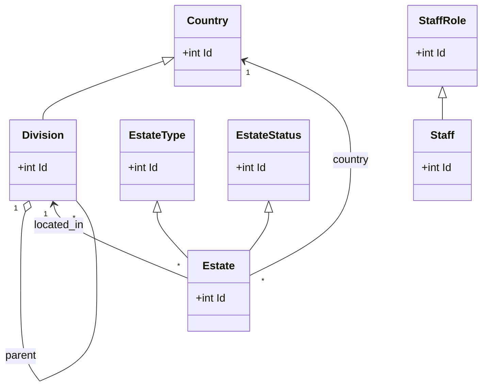

# Real Estate

This repository is a placeholder for the Real Estate project.

Status: Temporary README — updated to include domain entities and relationships.

## Purpose
Provide a concise mapping of the domain entities currently present in the codebase and describe their relationships so other contributors can quickly understand the data model.

## Common base
- `BaseEntity` (in `Core/Realestate.Domain/Entities/Commons/BaseEntity.cs`): `Id`, `IsDeleted`, `CreatedAt`, `UpdatedAt`.

## Entities
- `Country` — `Name, IsoTwo, IsoThree, IsoNumber, Cctld, Plate, Currency`
- `DivisionType` — `Name`
- `Division` — `Name, Code, CountryId, DivisionTypeId, ParentId`
- `EstateType` — `Name`
- `EstateStatus` — `Name`
- `Estate` — `Name, Description, Price, CountryId, ParentDivisionId, ChildDivisionId?, EstateTypeId, EstateStatusId`
- `StaffRole` — `Name`
- `Staff` — `Name, Surname, FullName (computed), Code, Email, PhoneNumber, StaffRoleId`

## Relationships (plain English)
- A `Country` contains many `Division`s; an `Estate` also belongs to a `Country`.
- `Division` is typed by `DivisionType` (each Division has one DivisionType).
- `Division` can have a parent `Division` (self-referencing hierarchical divisions via `ParentId`).
- An `Estate` is located within divisions via `ParentDivisionId` and optionally `ChildDivisionId` (estates reference division(s)).
- `Estate` references `EstateType` and `EstateStatus` (type and status lookup tables).
- `Staff` belongs to a `StaffRole` (via `StaffRoleId`).

## Relationships (adjacency list)
- Country -> Divisions, Estates
- DivisionType -> Divisions
- Division -> (Parent Division), Estates
- EstateType -> Estates
- EstateStatus -> Estates
- StaffRole -> Staff

## Simple diagram (Mermaid)
If you use a renderer that supports Mermaid, this shows the core relations:

## Next steps
- Add EF navigation properties if you want ORM-level relationships in code.
- Generate a PNG/SVG diagram from the Mermaid block for documentation.

This README can be extended with setup, build, and run instructions — tell me if you want that next.
